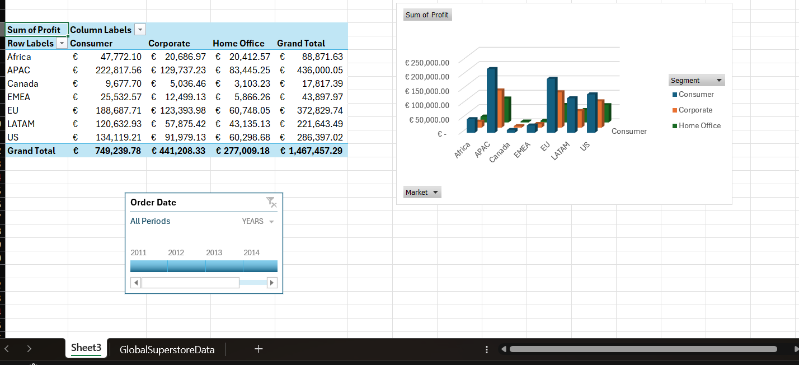
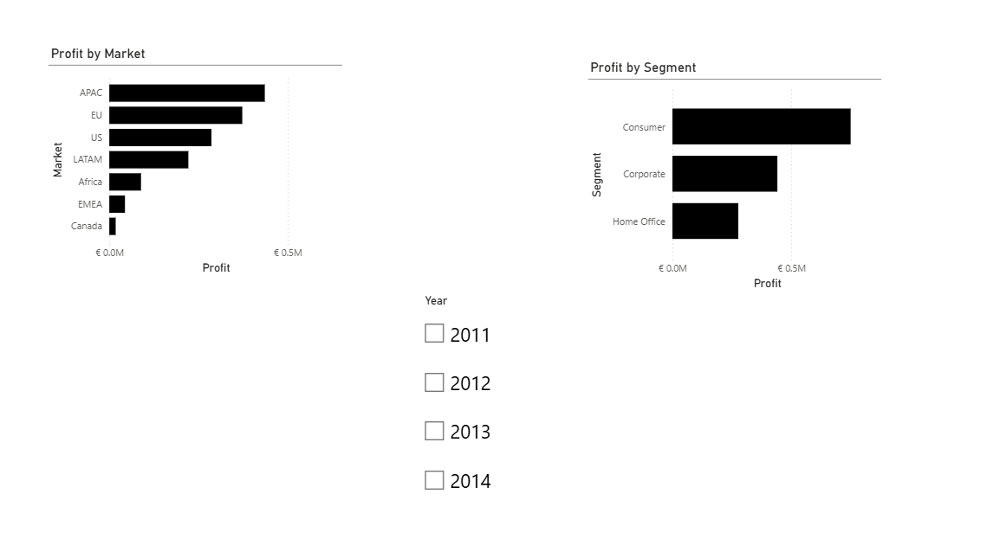

# 📊 Retail Sales Analysis: Turning 52,000+ Transactions into Actionable Insights

> **Business Challenge:** A global retail company needed to understand which markets and customer segments drive profitability, and where losses are occurring.

> **My Solution:** Built an end-to-end analytics pipeline using Excel for data cleaning, MySQL for complex queries, and Power BI for interactive visualization.

> **Impact:** Identified that 3 markets contribute 65% of total profits, enabling targeted strategy for underperforming regions.

---

## Project Overview

This is an end-to-end retail sales analysis project using a Global Superstore dataset.  
The goal was to understand sales performance, customer behavior (segments), and profitability across markets to support business decision-making.

## Business Questions

* Which **markets** generate the highest profit?
* Which **customer segments** are most profitable?
* How does profitability change **year by year**?
* Are there areas with **losses (negative profit)** that need attention?

## Dataset

* Source: Public "Global Superstore" dataset (used for portfolio/learning purposes)
* Size: 52,000+ transactional records
* Format: Excel/CSV
* Key Columns: `Order Date`, `Segment`, `Market`, `Sales`, `Profit`

## Tools Used

* **Microsoft Excel** (cleaning + pivot analysis + charts)
* **MySQL** (data type fixes + aggregation queries)
* **Power BI Desktop** (interactive dashboard)

---

## Excel Work

### Data Cleaning & Preparation

* Standardized mixed date formats and sorted dates chronologically
* Removed/handled blank date values
* Prepared data for time-based analysis

### Analysis

* Pivot Table: **Market × Segment → Sum of Profit**
* Pivot Chart: Visualized segment-wise profitability by market
* Timeline filter: Year-based analysis (similar to dashboard filtering)

---

## SQL (MySQL) Work

### Data Preparation

* Fixed import issues where numeric/date fields were stored as TEXT
* Converted:
  + `Sales`, `Profit` → DECIMAL
  + `Order Date` → DATE (where applicable)

### Core Analysis Queries

* Total sales & total profit
* Profit by market
* Profit by segment
* Profit by market × segment
* Year-wise and market-wise profit trends

[View SQL queries](sql/sql_queries.sql)

---

## Power BI Dashboard

Built a simple interactive dashboard to visualize:

* **Profit by Market**
* **Profit by Segment**
* **Year slicer** for filtering (2011–2014)

---

## Key Insights

* **Consumer segment** produced the highest overall profit
* **APAC and EU markets** showed strong profitability
* Sales peaked during **2013–2014**, indicating strong growth momentum
* Lower sales were observed in early years, particularly in 2011
* Year-based trends can be leveraged for better sales forecasting and planning

## Recommendations

* The company should analyze strategies used during high-sales periods and replicate them across weaker markets or segments
* Seasonal and year-based trends should be incorporated into forecasting models
* Focus resources on high-performing segments (Consumer) and markets (APAC, EU)
* Investigate underperforming markets for improvement opportunities

---

## 📁 Files in This Repository

- `README.md` - Project documentation (you're reading it!)
- `/screenshot/` - Dashboard and Excel visualizations
- `/sql/sql_queries.sql` - All SQL queries used for analysis
- `retail_sales_analysis.pbix` - Power BI dashboard (download to view)

**To explore this project:**
1. Read the SQL queries to understand the analysis approach
2. View screenshots to see final dashboards
3. Download .pbix file and open in Power BI Desktop (free) to interact with dashboard

---

## 💡 What I Learned

- How to handle mixed date formats and data type issues in large datasets
- Writing efficient SQL queries with multiple JOINs for complex analysis
- Creating executive-friendly dashboards that answer business questions at a glance
- The importance of data cleaning - spent 30% of project time on preparation!
- Balancing technical depth with business storytelling

---

## Author

**Md. Arafat Hossain**  
Data Analytics Student | International Business @ SMK College  
📧 arafat425455@gmail.com | 💼 [LinkedIn](https://linkedin.com/in/arafat-hossain-data) | 🔗 [GitHub](https://github.com/Hossainmdarafat)
